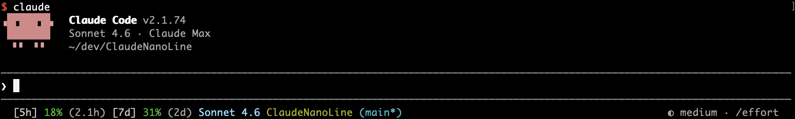
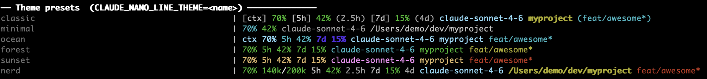
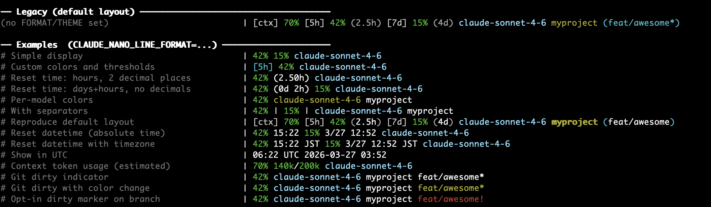

# ClaudeNanoLine

[Japanese version](README.ja.md)


A format-string-driven [statusLine](https://docs.anthropic.com/en/docs/claude-code/settings) for Claude Code. Show exactly what you want, the way you want it.



## Features

Like a shell `$PS1`, **a single format string controls what's displayed, how it's colored, and when items appear or hide**.

```bash
export CLAUDE_NANO_LINE_FORMAT="{5h_pct} {7d_pct} {model} {cwd} ({branch})"
```

- **Rich data** — API usage (5h / 7d), time until reset, context consumption, model name, Git branch, working directory, and more
- **Fine-grained control** — color thresholds, conditional visibility, time format overrides — all configurable per item
- **Theme presets** — pick from `ocean`, `nerd`, and others without writing a format string
- **Lightweight** — single Python file, no external packages. API responses cached for 360 seconds

## Quick Start

```sh
# 1. Install
curl -fsSL https://raw.githubusercontent.com/HappyOnigiri/ClaudeNanoLine/main/setup.sh | bash

# 2. Set your preferred format (optional — defaults are sensible)
export CLAUDE_NANO_LINE_FORMAT="{5h_pct} {model} {cwd} ({branch})"

# 3. Launch Claude Code — the status line appears immediately
claude
```

## Setup

### Automatic install (recommended)

```sh
curl -fsSL https://raw.githubusercontent.com/HappyOnigiri/ClaudeNanoLine/main/setup.sh | bash
```

Downloads `~/.claude/claude-nano-line.py` and adds the configuration to
`~/.claude/settings.json`. Shows a diff and asks for confirmation before making
changes.

### Manual install

1. Copy the script to `~/.claude/` and make it executable:

```sh
cp claude-nano-line.py ~/.claude/
chmod +x ~/.claude/claude-nano-line.py
```

2. Add the following to `~/.claude/settings.json`:

```json
{
  "statusLine": {
    "type": "command",
    "command": "python3 ~/.claude/claude-nano-line.py"
  }
}
```

## Requirements

- `python3` (3.7 or later)
- `security` (macOS only — for Keychain access)

## Windows support

Works on Git Bash or WSL. Run the installer (automatic or manual) from your Git
Bash or WSL shell.

- **Authentication**: Since macOS Keychain is unavailable on Windows, the token
  is read from `~/.claude/.credentials.json`. This file is created automatically
  when you log in with Claude Code.

## Customization

### Theme presets

Set `CLAUDE_NANO_LINE_THEME` to use a built-in theme without writing a format
string:



```sh
export CLAUDE_NANO_LINE_THEME=ocean
```

| Theme     | Description                                          |
| --------- | ---------------------------------------------------- |
| `classic` | Reproduces the legacy default layout                 |
| `minimal` | Minimal: ctx%, 5h%, model, path                      |
| `ocean`   | Blue/cyan palette                                    |
| `forest`  | Green palette                                        |
| `sunset`  | Warm amber/pink palette                              |
| `nerd`    | Maximum density: token counts + reset times included |

`CLAUDE_NANO_LINE_FORMAT` takes priority over `CLAUDE_NANO_LINE_THEME`. An
unknown theme name silently falls back to the legacy layout.

### Custom format

Set the `CLAUDE_NANO_LINE_FORMAT` environment variable to customize the status
line output. If not set, the default layout is used.

### Syntax

The format string is composed of tokens in `{type|options}` form.

**Value placeholders**: `{name}` or `{name|options}`

```
{5h_pct}
{5h_pct|color:green,warn-color:yellow,alert-color:red,warn-threshold:70,alert-threshold:90}
{5h_reset|format:dh}
```

**Literal text**: `{text:string}` or `{text:string|options}`

```
{text:[5h]|color:gray}
{text: | |color:gray}
```

### Placeholder reference

| Name               | Example           | Description                                                            |
| ------------------ | ----------------- | ---------------------------------------------------------------------- |
| `ctx_pct`          | `73%`             | Context window usage                                                   |
| `5h_pct`           | `27%`             | 5-hour window usage                                                    |
| `7d_pct`           | `15%`             | 7-day window usage                                                     |
| `5h_reset`         | `3.4h`            | Time until 5h window reset                                             |
| `7d_reset`         | `6d`              | Time until 7d window reset                                             |
| `5h_reset_at`      | `18:30`           | Reset time of 5h window                                                |
| `7d_reset_at`      | `3/25 09:00`      | Reset time of 7d window                                                |
| `model`            | `Sonnet`          | Model name                                                             |
| `cwd`              | `myproject`       | Directory basename                                                     |
| `cwd_short`        | `~/dev/proj`      | `~`-abbreviated path                                                   |
| `cwd_full`         | `/Users/.../proj` | Full path                                                              |
| `branch`           | `main`            | Git branch name                                                        |
| `branch_dirty`     | `main*`           | Git branch name with dirty marker (`*` when uncommitted changes exist) |
| `ctx_tokens`       | `140k`            | Remaining context tokens (estimated from model)                        |
| `ctx_used_tokens`  | `60k`             | Used context tokens (estimated from model)                             |
| `ctx_total_tokens` | `200k`            | Total context tokens (estimated from model)                            |

### Option reference

| Key               | Applies to               | Values                                                                            | Default               | Description                                                                                            |
| ----------------- | ------------------------ | --------------------------------------------------------------------------------- | --------------------- | ------------------------------------------------------------------------------------------------------ |
| `color`           | all                      | color name                                                                        | none                  | Display color                                                                                          |
| `warn-color`      | `*_pct`                  | color name                                                                        | `yellow`              | Color when usage exceeds warn threshold                                                                |
| `alert-color`     | `*_pct`                  | color name                                                                        | `red`                 | Color when usage exceeds alert threshold                                                               |
| `warn-threshold`  | `*_pct`                  | number                                                                            | `80`                  | Warning threshold (%)                                                                                  |
| `alert-threshold` | `*_pct`                  | number                                                                            | `95`                  | Alert threshold (%)                                                                                    |
| `format`          | `*_reset`                | `auto`/`hm`/`h1`/`dh`/`d1`                                                        | `auto`                | Time format (legacy option)                                                                            |
| `unit`            | `*_reset`                | `auto` / `h` / `d` / `dh`                                                         | `auto`                | Display unit (`h`=hours, `d`=days, `dh`=days+hours, `auto`=auto)                                       |
| `digits`          | `*_reset`                | number                                                                            | `1`                   | Decimal places (e.g. `digits:2` → `2.50h`)                                                             |
| `format`          | `*_reset_at`             | `auto`/`auto_tz`/`time`/`time_tz`/`datetime`/`datetime_tz`/`full`/`full_tz`/`iso` | `auto`                | Datetime format (`auto`=time if today, `M/D HH:MM` if different day)                                   |
| `tz`              | `*_reset_at`             | `local` / `utc`                                                                   | `local`               | Timezone for display                                                                                   |
| `on-error`        | `5h_pct`, `7d_pct`, `*_reset`, `*_reset_at` | `hide` / `text(string)`                                                    | (show error)          | Controls display when an API error occurs (`hide`=hide item, `text(...)`=show custom string)           |
| `hide-under`      | `ctx_pct`, `5h_pct`, `7d_pct`               | number (%)                                                                 | —                     | Hide the token when usage is below N% (also hides on missing data). Example: `hide-under:70`          |
| `hide-if`         | `branch`, `branch_dirty`, `model`, `cwd`, `cwd_short`, `cwd_full` | string                                                | —                     | Hide the token when its resolved value equals the given string (exact/case-sensitive match)           |
| `dirty-suffix`    | `branch`, `branch_dirty` | string                                                                            | `*` / `""`            | Suffix appended when repo is dirty (`branch_dirty` default: `*`; `branch` default: `""` — opt-in only) |
| `dirty-color`     | `branch`, `branch_dirty` | color name                                                                        | falls back to `color` | Color when repo is dirty                                                                               |
| `haiku-color`     | `model`                  | color name                                                                        | `amber`               | Color for Haiku model                                                                                  |
| `sonnet-color`    | `model`                  | color name                                                                        | `sky_blue`            | Color for Sonnet model                                                                                 |
| `opus-color`      | `model`                  | color name                                                                        | `pink`                | Color for Opus model                                                                                   |

### Available color names

`red`, `green`, `yellow`, `cyan`, `blue`, `magenta`, `gray`, `light_gray`,
`sky_blue`, `pink`, `amber`, `bold`, `bold_yellow`

### Examples



```bash
# Simple display
export CLAUDE_NANO_LINE_FORMAT="{5h_pct} {7d_pct} {model}"

# Custom colors and thresholds
export CLAUDE_NANO_LINE_FORMAT="{text:[5h]|color:cyan} {5h_pct|warn-threshold:70,alert-threshold:90} {model}"

# Usage + reset time in hours with 2 decimal places
export CLAUDE_NANO_LINE_FORMAT="{5h_pct} {text:(}{5h_reset|unit:h,digits:2}{text:)} {model}"

# Reset time as days+hours with no decimals
export CLAUDE_NANO_LINE_FORMAT="{5h_pct} {text:(}{5h_reset|unit:dh,digits:0}{text:)} {7d_pct} {model}"

# Per-model colors
export CLAUDE_NANO_LINE_FORMAT="{5h_pct} {model|haiku-color:green,sonnet-color:yellow,opus-color:blue} {cwd}"

# With separators
export CLAUDE_NANO_LINE_FORMAT="{5h_pct} {text:|} {7d_pct} {text:|} {model} {cwd}"

# Reproduce default layout
export CLAUDE_NANO_LINE_FORMAT="{text:[ctx]|color:gray} {ctx_pct} {text:[5h]|color:gray} {5h_pct} {text:(|color:light_gray}{5h_reset}{text:)|color:light_gray} {text:[7d]|color:gray} {7d_pct} {text:(|color:light_gray}{7d_reset}{text:)|color:light_gray} {model} {cwd|color:bold_yellow}{text: (|color:cyan}{branch}{text:)|color:cyan}"

# Show reset datetime (absolute time)
export CLAUDE_NANO_LINE_FORMAT="{5h_pct} {5h_reset_at} {7d_pct} {7d_reset_at} {model}"

# Show reset datetime with timezone
export CLAUDE_NANO_LINE_FORMAT="{5h_pct} {5h_reset_at|format:time_tz} {7d_pct} {7d_reset_at|format:datetime_tz} {model}"

# Show in UTC
export CLAUDE_NANO_LINE_FORMAT="{5h_reset_at|tz:utc,format:auto_tz} {7d_reset_at|tz:utc,format:full}"

# Context token usage (estimated from model name)
export CLAUDE_NANO_LINE_FORMAT="{ctx_pct} {ctx_used_tokens}/{ctx_total_tokens} {model}"

# Git dirty indicator (shows "main*" when there are uncommitted changes)
export CLAUDE_NANO_LINE_FORMAT="{5h_pct} {model} {cwd} {branch_dirty}"

# Git dirty with color change (cyan when clean, yellow when dirty)
export CLAUDE_NANO_LINE_FORMAT="{5h_pct} {model} {cwd} {branch_dirty|color:cyan,dirty-color:yellow}"

# Opt-in dirty marker on {branch} with custom suffix
export CLAUDE_NANO_LINE_FORMAT="{5h_pct} {model} {cwd} {branch|dirty-suffix:!,dirty-color:red}"

# Hide item on API error (silent fallback)
export CLAUDE_NANO_LINE_FORMAT="{5h_pct|on-error:hide} {model}"

# Show custom text on API error
export CLAUDE_NANO_LINE_FORMAT="{5h_pct|on-error:text(N/A)} {model}"

# Only show usage when it exceeds 70%
export CLAUDE_NANO_LINE_FORMAT="{5h_pct|hide-under:70} {7d_pct|hide-under:70} {model}"

# Show branch name only when not on main
export CLAUDE_NANO_LINE_FORMAT="{model} {cwd} {branch|hide-if:main}"

# Hide branch on main, hide usage under 80%
export CLAUDE_NANO_LINE_FORMAT="{5h_pct|hide-under:80} {model} {branch|hide-if:main}"
```

Add the `export` line to `~/.zprofile` or `~/.bashrc` to apply it permanently.

## Troubleshooting

### API usage shows `[5h] --%` / `[7d] --%`

- **No token**: Log in with Claude Code at least once. The token is stored in
  the macOS Keychain or `~/.claude/.credentials.json` on Windows/Linux.
- **Network**: The API may be unreachable. Check your firewall or proxy
  settings.

### Shows `Timeout`

The API request timed out. Check your network connection and wait a few minutes
(the cache expires after 360 seconds and will retry automatically).

### Shows `Usage API Rate Limit`

The API rate limit was hit. It will recover automatically after a short wait.

### Checking logs

Detailed API call logs are written to
`$XDG_STATE_HOME/claude-nano-line/claude-usage-api.log` (default:
`~/.local/state/claude-nano-line/`), which can help diagnose issues.

### Claude Code memory usage grows very high (macOS)

If Claude Code’s resident memory (RSS) balloons during long idle or active sessions and the system becomes sluggish or unresponsive, the cause is not well understood, but it may be more likely when using a custom status line. See [this Zenn article](https://zenn.dev/happy_onigiri/articles/9ae9080ba5eb88) for how to recognize the issue, recover manually, and optionally run a `launchd` watchdog that stops runaway processes before the Mac freezes. *(Japanese only.)*

## Contributing

Issues and pull requests are welcome — bug reports, feature ideas, documentation improvements, anything helps.
